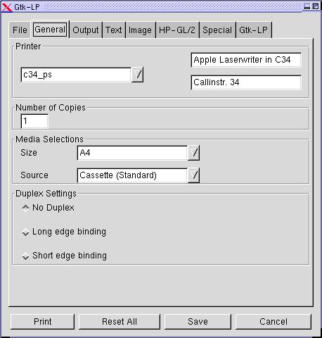

**GtkLP** and **GtkLPQ** are graphical frontends for CUPS. 
The development started around 2000 when I was a student and read about CUPS as the new printing system for Linux and programming in Gtk.
It was ment for our sutdents at the university, but was also used in many companies all over the world. 
But now, it is old and I am old and I haven't had the time to update it to the latest releases of Gtk and/or Cups for many years.
So I decided to archive it here. Perhaps someone could fork it and give it a new life.

The latest release is 1.3.4 from November 2019.

# Features
- Gtk-Interface with theme-support
- IPP support
- Printer specific options
- All standard-cups options
- different preferences-files for each printer
- easy to build
- gettext-support for different languages
- X- and Console-Support
- Support for both, gtk1 and gtk2
- hide printers
- select favorite printers

# Screenshots

(more images in [images/shots](images/shots))

# Language status report

# Documentation

(!) This documentation is rather old. The source would perhaps not compile with newer libs...

## Requirements
To install, you'll need at least:

* gtk+ 1.2.8 from gtk.org
* glib 1.2.8 from gtk.org
* cups 1.12 from cups.org 

Maybe it works with different versions too, but it's not tested.
Attention please: Gtk1 Support is only available up to version 1.2.6. You need Gtk2 for recent versions.

You should also have <s>recent</s> old versions of:

* gettext from gnu.org
* autoconf from gnu.org
* automake from gnu.org 

If you use rpm-packages, don`t forget to install also the devel-packages !

## Installation
Since version 0.9d you should be able to do it the following way:

1. unpack source-code
2. execute an ./configure
3. execute an make or gmake
4. execute an make install or gmake install 

If you want to install it to special locations, or if you have installed cups, or gtk to unusual places, please fiddle around with the command-line options of configure. You can see all options by executing ./configure --help.
If configure fails on your system, try to edit Makefile.fallback and use make -f Makefile.fallback && make -f Makefile.fallback install or gmake -f Makefile.fallback && gmake -f Makefile.fallback install.
... or just use some of the precompiled packages !

## Languages
Since version 0.9d GtkLP uses gettext, so the language of your interface depends on the environment-variable LC_ALL.
If your language is not support right now, please

1. Get the pot-file from the source
2. Rename it to fit to your language
3. For every string in msgid put your translation in the msgstr one line beneath. (or use a po-creation tool)

## Usage
You can call GtkLP in three ways:

* Without any parameters you can select files via integrated file-dialog
* With some filenames as parameter, file-dialog will also appear
* Within a pipe, e.g. from netscape, not file-dialog is show 

GtkLP knows many command-line parameters, please look at the manpage to see them all.

## Start
When starting, GtkLP first looks for its config-files at the following places:

1. the confdir from -c confdir at commandline
2. $HOME/.gtklp/
3. /etc/gtklp/ 

After that it uses defaults, which are good on my slackware-linux box ;-)
and asks the cups-libraries for the default server-settings.

In GtkLP you have also the chance to define the default browser.
You can choose every html-browser you like, the first "$1" will be substituted by the URL.

## Administration
If you want to define global defaults for all users, just call GtkLP and save
the preferences you like for each printer.
Then you only have to put all files from your $HOME/.gtklp/ to the global confdir.
Since version 0.9, you have also to add the default-ppd-options via the cups-webfrontend or lpadmin.
For some special circumstances it is also usefull to define then following environment
variables:

* CUPS_SERVER The default printserver to attach to
* IPP_PORT The default port to attach to
* PRINTER The default printer to use
* GTKLP_FORCEX Set to 1 to force X-Mode

The last variable is a special one.
If you call GtkLP as lp, or as lpr (by alias or softlink), it tries to emulate the behaviour of this tools. So it has different command-line parameters and uses console-mode by default (if GTKLP_FORCEX not set).
Please have a look at the man-page to see the changes. GtkLPQ
Since version 0.8 there is also an *very* small queue-tool, GtkLPQ, included.
It has no config-files, so you have to call it with command-line-parameters.
Look at the manpage to see them.
If you call it as lpq and acts as normal lpq, the same for lprm, enable, disable, accept, reject. System specific issues

## Solutions
Solaris:
Sometimes the compilations fails due to missing libraries (shouldn't configure find them??), on Solaris 10 try to use
     ./configure LDFLAGS=-lX11
or
     gmake LDFLAGS=-lX11
to compile GtkLP.

Irix:
There are problems compiling gtklp-1.0c under IRIX 6.5.22f, cause "basename" was not found when linking gtklp.
Please use
     ./configure LDFLAGS=-lgen
to solve this Problem.

Also the fonts could look a little big ugly with Gtk2. In this case you should use Gtk1 instead:
     ./configure --enable-gtk1 LDFLAGS=-lgen
Attention please: This option is not available in versions later than 1.2.6.

Thanks to Dirk Engel for this hints!

Systems with too many printers
For GtkLP before version 1.0g:
If you have more than 100 printers in your network, you have to increase the value "MAX_PRT" in "includes/default.h" before compiling GtkLP or it won't work.

Since version 1.0g the default is 150 printers. You can change this value with the configure option "--with-maxprinters=".

**Have luck!**
