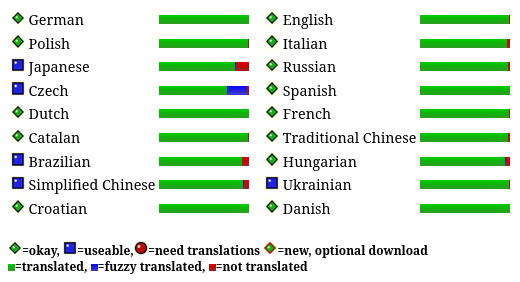

# Overview 

**GtkLP** and **GtkLPQ** are graphical frontends for CUPS. 
The development started around 2000 when I was a student and read about CUPS as the new printing system for Linux and programming in Gtk.
It was ment for out users at the university, but was also used in many companies all over the world. 
But now, it is old and I am old and I haven't had the time to update it to the latest releases of Gtk and/or Cups for many years.
So I decided to archive it here. Perhaps someone could fork it and give it a new life.

The latest release is 1.3.4 from November 2019.

# Features
- Gtk-Interface with theme-support
- IPP support
- Printer specific options
- All standard-cups options
- different preferences-files for each printer
- easy to build
- gettext-support for different languages
- X- and Console-Support
- Support for both, gtk1 and gtk2
- hide printers
- select favorite printers

# Language status report

